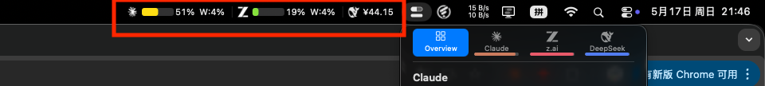
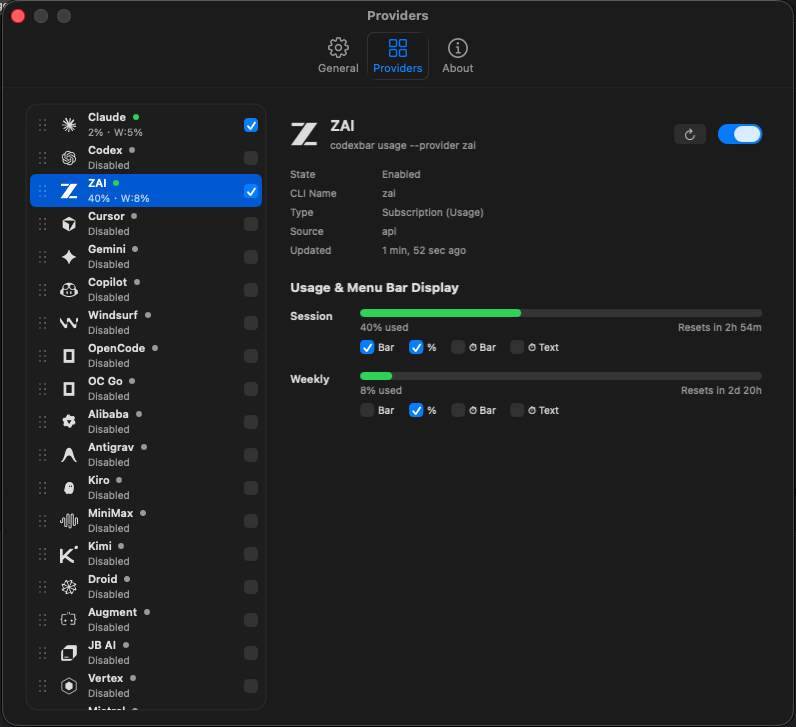

<div align="center">

**[English](#codexbarmenubar) | [简体中文](#codexbarmenubar中文)**

</div>

# CodexBarMenuBar

### ⚡ See your AI usage at a glance — right in the macOS menu bar.

**No need to open CodexBar.app. No clicks. No switching apps.** Just look up to the menu bar and instantly know how much Claude, Codex, ZAI, DeepSeek and 35+ other AI providers you've used today.

> ⚠️ **Requires [CodexBar CLI](https://github.com/steipete/CodexBar).** This app does NOT call AI provider APIs directly — all data is fetched through CodexBar CLI. Without CodexBar CLI, this app shows nothing.



In the screenshot, three providers are shown side-by-side in the menu bar:
- **Claude**: green usage bar with `19% W:2%` (session and weekly)
- **ZAI**: usage bar with `0% W:1%`
- **DeepSeek**: balance `¥44.15`

That's it — your AI quota always visible, never hidden behind another window.

### Customizable in Settings



Drag-to-reorder providers, toggle each metric independently (Bar, %, ⏱ Bar, ⏱ Text), enable/disable any provider with one click.

## Versioning

**This app's version tracks [CodexBar CLI](https://github.com/steipete/CodexBar) version.** For example, CodexBarMenuBar `0.26.1` matches CodexBar CLI `0.26.1`. Always install the matching version of both.

## Features

- **Real-time usage bars** with color-coded progress (green -> yellow -> orange -> red)
- **40 AI providers** supported: Claude, Cursor, Gemini, Copilot, Windsurf, ZAI, DeepSeek, OpenAI, Bedrock, and many more
- **Per-window metrics**: session usage, weekly usage, and provider-specific extra windows (e.g., Claude Designs, Daily Routines)
- **Countdown timers**: optional countdown bar and text for reset times
- **Balance display**: credit-based providers show remaining balance (e.g., DeepSeek `¥44.15`)
- **Fully customizable**: toggle individual metrics (bar, percentage, countdown bar, countdown text) per window per provider
- **Drag-and-drop reordering** of providers in settings
- **Native macOS settings** with tabbed interface (General, Providers, About)
- **Account info display**: shows account organization and data source per provider
- **Launch at Login** support

## Prerequisites

1. macOS 15.0+
2. **[CodexBar](https://github.com/steipete/CodexBar) installed and configured with your AI provider accounts.** Install CodexBar (the CLI provider) via Homebrew:
   ```bash
   brew install --cask codexbar
   ```
   After installation, open CodexBar.app and log in to the AI providers you want to monitor.

## Installation

1. Download `CodexBarMenuBar.zip` from [Releases](../../releases) (match the version with your installed CodexBar CLI)
2. Unzip and drag `CodexBarMenuBar.app` to `/Applications`
3. Launch the app — it appears in the menu bar, no Dock icon

Or build from source:
```bash
git clone https://github.com/Lobobodev/CodexBarMenuBar.git
cd CodexBarMenuBar
open CodexBarMenuBar.xcodeproj
```
Then build and run with `Cmd+R` in Xcode.

## Supported Providers (matches CodexBar CLI 0.26+)

| Type | Providers |
|------|-----------|
| **Usage Bar** | Claude, Codex, ZAI, Cursor, Gemini, Copilot, Windsurf, OpenCode, OC Go, Alibaba, Antigravity, Kiro, MiniMax, Kimi, Droid, Augment, JetBrains AI, Vertex AI, Mistral, Synthetic, Codebuff, Abacus AI, Perplexity, Amp, Ollama, Manus, MiMo, CmdCode, StepFun |
| **Balance** | DeepSeek, OpenRouter, Warp, Kilo, KimiK2, OpenAI, Moonshot, Doubao, Crof, Venice, Bedrock |

## How It Works

```
CodexBarMenuBar  -->  codexbar CLI  -->  AI Provider APIs
     (display)        (data fetch)       (authentication)
```

The app periodically runs `codexbar usage --provider <name> --format json` and renders the results in the menu bar.

## License

[MIT](LICENSE)

---

# CodexBarMenuBar（中文）

### ⚡ AI 用量一眼可见 — 直接显示在 macOS 顶部菜单栏

**不用打开 CodexBar.app，不用点击，不用切换窗口。** 抬头看一眼菜单栏，立刻知道今天的 Claude、Codex、ZAI、DeepSeek 等 35+ 个 AI 用了多少。

> ⚠️ **需要先安装 [CodexBar CLI](https://github.com/steipete/CodexBar)。** 本应用**不直接调用任何 AI 提供商 API**，所有数据通过 CodexBar CLI 获取。没有 CodexBar CLI，本应用什么都不会显示。


上图展示了菜单栏中并列显示的三个 AI 提供商：
- **Claude**：绿色进度条 `19% W:2%`（会话和周用量）
- **ZAI**：进度条 `0% W:1%`
- **DeepSeek**：余额 `¥44.15`

AI 用量始终在你眼前，再也不用埋在别的窗口里。

### 设置界面可自由定制


拖拽调整 Provider 顺序，每项指标（进度条 / 百分比 / 倒计时条 / 倒计时文字）独立开关，一键启用/禁用任何 Provider。

## 版本号说明

**本应用的版本号跟随 [CodexBar CLI](https://github.com/steipete/CodexBar) 版本。** 例如 CodexBarMenuBar `0.26.1` 对应 CodexBar CLI `0.26.1`。请始终安装版本相匹配的两个程序。

## 功能

- **实时用量进度条**，颜色随用量变化（绿 -> 黄 -> 橙 -> 红）
- **支持 40 个 AI 提供商**：Claude、Cursor、Gemini、Copilot、Windsurf、ZAI、DeepSeek、OpenAI、Bedrock 等
- **多维度指标**：会话用量、周用量，以及提供商特有窗口（如 Claude 的 Designs、Daily Routines）
- **倒计时显示**：可选的倒计时进度条和文字，显示重置时间
- **余额显示**：按量付费的提供商直接显示余额（如 DeepSeek `¥44.15`）
- **完全可定制**：每个提供商的每个指标窗口可独立开关（进度条、百分比、倒计时条、倒计时文字）
- **拖拽排序**：在设置中拖拽调整提供商显示顺序
- **原生 macOS 设置界面**：标签式布局（通用、提供商、关于）
- **账号信息显示**：详情页显示账号所属组织和数据来源
- **开机自启**

## 前置条件

1. macOS 15.0+
2. **已安装并配置好 [CodexBar](https://github.com/steipete/CodexBar)**（数据提供方）。通过 Homebrew 安装：
   ```bash
   brew install --cask codexbar
   ```
   安装后打开 CodexBar.app，登录你想监控的 AI 提供商账号。

## 安装

1. 从 [Releases](../../releases) 下载 `CodexBarMenuBar.zip`（版本号需要与已安装的 CodexBar CLI 一致）
2. 解压后将 `CodexBarMenuBar.app` 拖入 `/Applications`
3. 启动应用 — 直接出现在菜单栏，无 Dock 图标

或从源码构建：
```bash
git clone https://github.com/Lobobodev/CodexBarMenuBar.git
cd CodexBarMenuBar
open CodexBarMenuBar.xcodeproj
```
在 Xcode 中 `Cmd+R` 运行。

## 支持的 Provider（对应 CodexBar CLI 0.26+）

| 类型 | Provider |
|------|----------|
| **用量进度条** | Claude, Codex, ZAI, Cursor, Gemini, Copilot, Windsurf, OpenCode, OC Go, Alibaba, Antigravity, Kiro, MiniMax, Kimi, Droid, Augment, JetBrains AI, Vertex AI, Mistral, Synthetic, Codebuff, Abacus AI, Perplexity, Amp, Ollama, Manus, MiMo, CmdCode, StepFun |
| **余额显示** | DeepSeek, OpenRouter, Warp, Kilo, KimiK2, OpenAI, Moonshot, Doubao, Crof, Venice, Bedrock |

## 工作原理

```
CodexBarMenuBar  -->  codexbar CLI  -->  AI 提供商 API
     (显示)           (数据获取)         (认证)
```

应用定期运行 `codexbar usage --provider <name> --format json`，将结果渲染到菜单栏。

## 许可证

[MIT](LICENSE)
